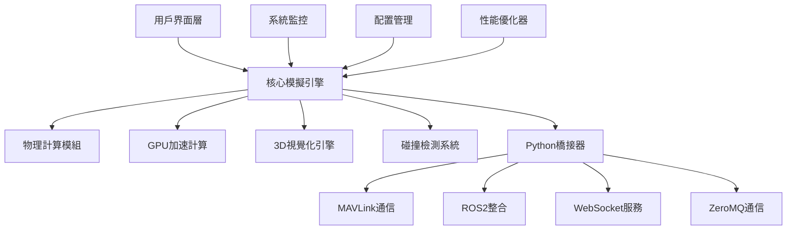

# 🚁 增強版無人機群飛模擬器 v9.0 Professional Edition

## 📋 目錄

- [系統概述](#系統概述)
- [系統架構](#系統架構)
- [核心特性](#核心特性)
- [安裝指南](#安裝指南)
- [快速開始](#快速開始)
- [詳細配置](#詳細配置)
- [模組使用說明](#模組使用說明)
- [性能優化](#性能優化)
- [Python整合](#python整合)
- [故障排除](#故障排除)
- [常見問題](#常見問題)
- [開發指南](#開發指南)
- [更新日誌](#更新日誌)
- [貢獻指南](#貢獻指南)
- [授權信息](#授權信息)

---

## 🎯 系統概述

**增強版無人機群飛模擬器**是一套專業級的無人機群飛仿真平台，整合了先進的物理建模、GPU加速計算、3D視覺化渲染和多協議通信功能。本系統專為無人機研究、群飛算法開發和系統驗證而設計。

### 🏗️ 系統架構



### ✨ 核心特性

#### 🔥 GPU加速計算
- **強制GPU啟用**：智能GPU設備選擇和強制啟用機制
- **CUDA核心優化**：自定義CUDA核心函數實現高性能計算
- **批次處理**：大規模無人機群的高效並行計算
- **記憶體管理**：智能GPU記憶體分配和回收機制

#### 📐 高精度物理建模
- **SO(3)群論控制**：避免歐拉角奇異點問題的先進控制理論
- **完整動力學耦合**：包含陀螺效應和電機動力學的精確模擬
- **多機型支援**：DJI Phantom、FPV競速機、載重機等不同配置
- **可配置參數**：軸距、螺旋槳尺寸、電池規格等可自定義

#### 🎨 3D視覺化渲染
- **真實無人機模型**：替代傳統星星圖標的精細3D模型
- **多層次細節(LOD)**：根據距離自動調整模型精度
- **視覺效果系統**：螺旋槳下洗流、軌跡尾巴等特效
- **高品質渲染**：支援陰影、反射、抗鋸齒等高級渲染功能

#### 🌉 多協議整合
- **MAVLink支援**：與QGroundControl等地面站軟體整合
- **ROS2橋接**：無縫連接機器人操作系統生態
- **WebSocket即時通信**：支援網頁端監控和控制
- **ZeroMQ高性能傳輸**：低延遲數據傳輸

#### 📊 系統監控與診斷
- **即時性能監控**：CPU、記憶體、GPU使用率追蹤
- **智能警告系統**：自動檢測系統異常並發出警告
- **診斷報告生成**：詳細的系統健康評估和優化建議
- **日誌管理**：完整的操作日誌和錯誤追蹤

---

## 🛠️ 安裝指南

### 系統需求

#### 最低需求
- **操作系統**：Windows 10/11, macOS 10.15+, Ubuntu 18.04+
- **MATLAB版本**：R2019b 或更新版本
- **記憶體**：8GB RAM (建議16GB+)
- **存儲空間**：5GB 可用空間
- **顯示器**：1920x1080 解析度

#### 推薦配置
- **處理器**：Intel i7-8700K 或 AMD Ryzen 7 3700X 以上
- **記憶體**：32GB RAM
- **顯示卡**：NVIDIA GTX 1070 或更新 (4GB+ VRAM)
- **存儲**：SSD 固態硬碟

#### 必要工具箱
- **Parallel Computing Toolbox** (GPU加速必須)
- **Statistics and Machine Learning Toolbox** (建議)
- **Image Processing Toolbox** (建議)
- **Signal Processing Toolbox** (建議)

#### Python環境 (可選)
- **Python版本**：3.8+ 
- **必要套件**：numpy, scipy, asyncio, websockets, pyzmq
- **MAVLink支援**：pymavlink
- **ROS2支援**：rclpy, geometry_msgs, nav_msgs

### 📥 安裝步驟

#### 步驟 1：下載和解壓
```bash
# 下載完整套件
git clone https://github.com/your-repo/enhanced-drone-simulator.git
cd enhanced-drone-simulator

# 或下載ZIP並解壓到工作目錄
```

#### 步驟 2：一鍵部署
```matlab
% 在MATLAB中運行一鍵部署
quick_deploy()

% 或使用完整部署管理器
deploy_manager = DeploymentManager();
deploy_manager.deploy_complete_system();
```

#### 步驟 3：驗證安裝
```matlab
% 快速系統檢查
quick_system_check()

% 運行性能測試
run_quick_performance_test()
```

---

## 🚀 快速開始

### 基本使用流程

#### 1. 啟動模擬器
```matlab
% 方法1：一鍵啟動（推薦）
Enhanced_Drone_Simulator_Launcher()

% 方法2：手動啟動
simulator = GPU_Enhanced_DroneSwarmSimulator();
```

#### 2. 創建測試任務
```matlab
% 創建演示數據
simulator.create_demo_data();

% 開始模擬
simulator.start_simulation();
```

#### 3. 載入任務文件
```matlab
% 載入QGroundControl任務文件
simulator.load_qgc_file('missions/sample_mission.plan');

% 或載入CSV軌跡文件
simulator.load_csv_file('data/sample_trajectory.csv');
```

#### 4. 控制模擬
- **播放/暫停**：點擊GUI中的播放按鈕或使用空格鍵
- **時間控制**：拖拽時間滑桿跳轉到指定時間
- **速度調整**：使用速度滑桿控制播放速度
- **視角控制**：滑鼠右鍵拖拽旋轉，滾輪縮放，中鍵平移

### 🎮 基本操作

| 操作 | 方法 | 說明 |
|------|------|------|
| 旋轉視角 | 滑鼠右鍵 + 拖拽 | 繞中心點旋轉視角 |
| 縮放 | 滾輪 | 放大/縮小視圖 |
| 平移 | 滑鼠中鍵 + 拖拽 | 移動視圖中心 |
| 播放/暫停 | 空格鍵或播放按鈕 | 控制模擬播放 |
| 重置視角 | R鍵 | 恢復默認視角 |
| 全螢幕 | F11 | 切換全螢幕模式 |

---

## ⚙️ 詳細配置

### 物理參數配置

#### 無人機類型配置
```matlab
% DJI Phantom風格
phantom_physics = EnhancedQuadrotorPhysics('phantom');

% FPV競速機
racing_physics = EnhancedQuadrotorPhysics('racing');

% 載重貨運機
cargo_physics = EnhancedQuadrotorPhysics('cargo');

% 自定義配置
custom_physics = EnhancedQuadrotorPhysics('standard');
```

#### 參數調整示例
```matlab
% 修改軸距（從580mm改為450mm）
config = custom_physics.airframe_config('standard');
config.wheelbase = 0.45;  % 450mm軸距
config.arm_length = 0.225; % 對應臂長
custom_physics.airframe_config('standard') = config;

% 修改螺旋槳規格
custom_physics.propulsion_system.prop_diameter = 0.2032; % 8英吋
custom_physics.propulsion_system.prop_pitch = 0.1016;   % 4英吋螺距

% 修改電池容量
custom_physics.battery_system.capacity_mah = 6000; % 6000mAh
```

### GPU計算配置

#### GPU設置
```matlab
% 創建GPU計算核心
gpu_core = GPUComputeCore();

% 檢查GPU可用性
if gpu_core.is_gpu_available()
    fprintf('GPU可用，啟用加速計算\n');
else
    fprintf('GPU不可用，使用CPU模式\n');
end

% 調整批次大小
gpu_core.batch_size = 2048; % 根據GPU記憶體調整
```

#### 性能優化
```matlab
% 創建性能優化器
optimizer = PerformanceOptimizer(simulator);

% 執行自動優化
optimizer.auto_optimize_settings();

% 執行基準測試
benchmark_results = optimizer.run_comprehensive_benchmark();
```

### 視覺化配置

#### 渲染品質設置
```matlab
% 創建增強視覺化系統
enhanced_viz = Enhanced3DVisualizationSystem(simulator);

% 設置渲染品質
enhanced_viz.render_quality.level = 'ultra';  % low, medium, high, ultra
enhanced_viz.render_quality.shadows_enabled = true;
enhanced_viz.render_quality.anti_aliasing = 8;

% 配置視覺效果
enhanced_viz.particle_systems('propwash').enabled = true;
enhanced_viz.trail_systems('default').enabled = true;
enhanced_viz.trail_systems('default').fade_time = 15.0;
```

#### LOD系統配置
```matlab
% 配置多層次細節
enhanced_viz.lod_system.enabled = true;
enhanced_viz.lod_system.distances = [30, 100, 300]; % 切換距離(米)
enhanced_viz.lod_system.models = {'detailed', 'simplified', 'icon'};
```

---

## 📦 模組使用說明

### 1. GPU計算核心 (GPUComputeCore)

```matlab
% 創建GPU計算核心
gpu_core = GPUComputeCore();

% GPU碰撞檢測
[conflicts, computation_time] = gpu_core.detect_collisions_gpu(drone_positions, timestamps, 5.0);

% GPU軌跡插值
interpolated_positions = gpu_core.interpolate_trajectory_gpu(trajectory, query_times);

% 打印性能摘要
gpu_core.print_performance_summary();
```

### 2. 增強物理模組 (EnhancedQuadrotorPhysics)

```matlab
% 創建物理模組
physics = EnhancedQuadrotorPhysics('phantom');

% 查看可用配置
config_list = physics.list_available_configurations();

% 打印配置摘要
physics.print_configuration_summary();

% 驗證物理參數
physics.validate_physics_parameters();
```

### 3. 3D視覺化系統 (Enhanced3DVisualizationSystem)

```matlab
% 創建3D視覺化系統
viz_system = Enhanced3DVisualizationSystem(simulator);

% 設置渲染參數
viz_system.render_quality.level = 'high';
viz_system.animation_settings.propeller_rotation = true;
viz_system.lighting_system.sun_light.intensity = 0.8;

% 替換模擬器的視覺化系統
simulator.visualization = viz_system;
```

### 4. 系統監控 (SystemMonitor)

```matlab
% 創建系統監控器
monitor = SystemMonitor();

% 註冊警告回調
monitor.register_alert_callback('CPU_HIGH', @(alert) fprintf('CPU警告: %s\n', alert.message));

% 開始監控
monitor.start_monitoring(true); % 帶GUI

% 生成診斷報告
monitor.generate_diagnostic_report();

% 停止監控
monitor.stop_monitoring();
```

### 5. 性能優化器 (PerformanceOptimizer)

```matlab
% 創建性能優化器
optimizer = PerformanceOptimizer(simulator);

% 執行基準測試
benchmark_results = optimizer.run_comprehensive_benchmark();

% 自動優化設置
optimized_settings = optimizer.auto_optimize_settings();
```

---

## 🐍 Python整合

### 安裝Python依賴

```bash
# 基本依賴
pip install numpy scipy matplotlib asyncio websockets pyzmq

# MAVLink支援
pip install pymavlink

# ROS2支援 (Ubuntu)
sudo apt install ros-foxy-desktop-full
pip install rclpy
```

### Python橋接器使用

#### 基本配置
```python
from python_matlab_bridge import DroneSimulationBridge

# 創建配置
config = {
    'matlab_path': '/path/to/your/matlab/workspace',
    'mavlink_connection': 'udp:localhost:14550',
    'ros2_node_name': 'drone_sim_bridge',
    'websocket_port': 8765,
    'zmq_port': 5555
}

# 創建橋接器
bridge = DroneSimulationBridge(config)
```

#### 啟動橋接器
```python
import asyncio

async def main():
    bridge = DroneSimulationBridge()
    await bridge.start()

if __name__ == "__main__":
    asyncio.run(main())
```

#### 或使用預生成的啟動腳本
```bash
# 啟動Python橋接器
python start_python_bridge.py

# 或使用啟動器
python launch_python_bridge.py
```

### MAVLink通信示例

```python
from python_matlab_bridge import MissionWaypoint

# 創建航點任務
waypoints = [
    MissionWaypoint(0, 24.7814, 120.9935, 50),  # 起飛點
    MissionWaypoint(1, 24.7824, 120.9945, 50),  # 航點1
    MissionWaypoint(2, 24.7834, 120.9955, 50),  # 航點2
]

# 發送到無人機
bridge.send_mission_to_drone('drone_1', waypoints)
```

### WebSocket客戶端示例

```html
<!DOCTYPE html>
<html>
<head>
    <title>無人機監控</title>
</head>
<body>
    <div id="status"></div>
    <script>
        const ws = new WebSocket('ws://localhost:8765');
        
        ws.onmessage = function(event) {
            const data = JSON.parse(event.data);
            document.getElementById('status').innerHTML = 
                `活躍無人機: ${Object.keys(data.drone_states).length}`;
        };
    </script>
</body>
</html>
```

---

## 🔧 故障排除

### 常見問題及解決方案

#### GPU相關問題

**問題：GPU檢測失敗**
```
錯誤：GPU不可用，將使用CPU模式
```
**解決方案：**
1. 檢查GPU驅動程式是否正確安裝
2. 確認Parallel Computing Toolbox授權
3. 重新啟動MATLAB
```matlab
% 檢查GPU狀態
gpuDevice()

% 重置GPU設備
gpuDevice([])
gpuDevice(1)
```

**問題：GPU記憶體不足**
```
錯誤：GPU記憶體分配失敗
```
**解決方案：**
1. 減少批次大小
2. 清理GPU記憶體
3. 降低模擬複雜度
```matlab
% 清理GPU記憶體
clear gpu_arrays
gpuDevice([])

% 調整批次大小
gpu_core.batch_size = 512; % 從1024降到512
```

#### 視覺化問題

**問題：3D模型顯示異常**
```
錯誤：模型渲染失敗
```
**解決方案：**
1. 更新顯示卡驅動程式
2. 降低渲染品質
3. 禁用部分視覺效果
```matlab
% 降級到基本渲染
viz_system.render_quality.level = 'low';
viz_system.particle_systems('propwash').enabled = false;
```

**問題：FPS過低**
```
表現：畫面卡頓，FPS<15
```
**解決方案：**
1. 調整LOD距離
2. 減少同時顯示的無人機數量
3. 關閉陰影和特效
```matlab
% 優化視覺化設置
viz_system.lod_system.distances = [20, 50, 100];
viz_system.render_quality.shadows_enabled = false;
viz_system.render_quality.anti_aliasing = 2;
```

#### MATLAB相關問題

**問題：記憶體不足**
```
錯誤：Out of memory
```
**解決方案：**
1. 增大虛擬記憶體
2. 清理工作空間
3. 減少軌跡點數量
```matlab
% 清理工作空間
clear all
close all

% 檢查記憶體使用
memory

% 限制軌跡歷史
simulator.max_trajectory_points = 5000;
```

#### Python橋接問題

**問題：Python橋接無法啟動**
```
錯誤：ImportError或連接失敗
```
**解決方案：**
1. 檢查Python環境
2. 安裝缺失的套件
3. 檢查網路端口
```bash
# 檢查Python版本
python --version

# 安裝缺失套件
pip install -r requirements.txt

# 檢查端口占用
netstat -an | grep 8765
```

### 診斷工具

#### 系統檢查
```matlab
% 快速系統檢查
quick_system_check()

% 完整系統診斷
monitor = SystemMonitor();
monitor.generate_diagnostic_report();
```

#### 性能測試
```matlab
% 快速性能測試
run_quick_performance_test()

% GPU計算核心測試
test_gpu_compute_core()
```

#### 日誌檢查
```matlab
% 查看部署日誌
type('deployment.log')

% 查看系統監控日誌
dir('logs/system_monitor_*.log')
```

---

## ❓ 常見問題

### Q1：如何選擇合適的無人機物理模型？

**A：**根據您的應用需求選擇：
- **DJI Phantom風格**：適合攝影測量、巡檢等應用
- **FPV競速機**：適合競速、機動性測試
- **載重機**：適合貨運、重載應用
- **標準四旋翼**：通用測試和研究

### Q2：如何提升碰撞檢測性能？

**A：**
1. 啟用GPU加速：`gpu_core.enabled = true`
2. 調整安全距離：`simulator.safety_distance = 3.0`
3. 優化更新頻率：`simulator.collision_check_interval = 0.2`
4. 使用批次處理：增大`batch_size`

### Q3：如何自定義無人機參數？

**A：**
```matlab
% 創建自定義物理模組
physics = EnhancedQuadrotorPhysics('standard');

% 修改參數
physics.propulsion_system.prop_diameter = 0.25; % 10英吋螺旋槳
physics.battery_system.capacity_mah = 8000;     % 8000mAh電池
physics.airframe_config('standard').mass = 2.0; % 2kg總重

% 應用到模擬器
simulator.physics_module = physics;
```

### Q4：如何整合自己的控制算法？

**A：**
1. 繼承基礎控制器類
2. 實現自定義控制邏輯
3. 註冊到模擬器
```matlab
% 自定義控制器示例
classdef MyCustomController < BaseController
    methods
        function control_commands = compute_control(obj, drone_state, target)
            % 您的控制算法實現
            control_commands = custom_control_algorithm(drone_state, target);
        end
    end
end

% 註冊控制器
simulator.register_controller('my_controller', MyCustomController());
```

### Q5：如何匯出模擬結果？

**A：**
```matlab
% 匯出軌跡數據
simulator.export_trajectory_data('results/simulation_results.csv');

% 匯出碰撞報告
simulator.export_collision_report('results/collision_analysis.json');

% 匯出性能報告
optimizer.export_performance_report('results/performance_analysis.pdf');
```

---

## 👨‍💻 開發指南

### 程式碼結構

```
enhanced-drone-simulator/
├── core/                          # 核心模組
│   ├── DroneSwarmSimulator.m     # 主模擬器
│   ├── GPU_Enhanced_DroneSwarmSimulator.m # GPU增強版
│   └── Enhanced3DVisualizationSystem.m   # 3D視覺化
├── physics/                       # 物理模組
│   ├── EnhancedQuadrotorPhysics.m
│   └── quadrotor_dynamics.py
├── gpu/                          # GPU計算
│   └── GPUComputeCore.m
├── monitoring/                   # 系統監控
│   ├── SystemMonitor.m
│   └── PerformanceOptimizer.m
├── python/                       # Python整合
│   ├── python_matlab_bridge.py
│   └── start_python_bridge.py
├── deployment/                   # 部署管理
│   ├── DeploymentManager.m
│   └── Enhanced_Drone_Simulator_Launcher.m
├── configs/                      # 配置文件
├── missions/                     # 任務文件
├── data/                        # 數據文件
└── logs/                        # 日誌文件
```

### 擴展開發

#### 添加新的物理模型
```matlab
% 1. 在EnhancedQuadrotorPhysics.m中添加新配置
function new_config = create_new_drone_config(obj)
    new_config = struct();
    new_config.name = '新型無人機';
    new_config.mass = 3.5;
    new_config.wheelbase = 1.2;
    % ... 其他參數
end

% 2. 註冊新配置
obj.airframe_config('new_drone') = new_config;
```

#### 添加新的視覺效果
```matlab
% 1. 在Enhanced3DVisualizationSystem.m中添加新效果
function setup_new_effect(obj)
    new_effect = struct();
    new_effect.enabled = true;
    new_effect.parameters = your_effect_parameters;
    
    obj.effect_systems('new_effect') = new_effect;
end

% 2. 在渲染循環中調用
function render_new_effect(obj, position, parameters)
    % 您的效果渲染代碼
end
```

#### 添加新的通信協議
```python
# 1. 在python_matlab_bridge.py中添加新協議類
class NewProtocolInterface:
    def __init__(self, config):
        self.config = config
        
    def connect(self):
        # 連接邏輯
        pass
        
    def send_data(self, data):
        # 數據發送邏輯
        pass

# 2. 整合到主橋接器
bridge.add_protocol_interface('new_protocol', NewProtocolInterface(config))
```

### 測試指南

#### 單元測試
```matlab
% 測試物理模組
function test_physics_module()
    physics = EnhancedQuadrotorPhysics('standard');
    assert(physics.get_total_mass() > 0);
    fprintf('✅ 物理模組測試通過\n');
end

% 測試GPU計算
function test_gpu_compute()
    gpu_core = GPUComputeCore();
    if gpu_core.is_gpu_available()
        test_data = generate_test_trajectories(5, 100);
        conflicts = gpu_core.detect_collisions_gpu(test_data, 1:100, 5.0);
        assert(isstruct(conflicts));
        fprintf('✅ GPU計算測試通過\n');
    end
end
```

#### 整合測試
```matlab
% 完整系統測試
function run_integration_tests()
    fprintf('🧪 執行整合測試...\n');
    
    % 創建模擬器
    simulator = GPU_Enhanced_DroneSwarmSimulator();
    
    % 載入測試數據
    simulator.create_demo_data();
    
    % 運行短時間模擬
    simulator.start_simulation();
    pause(10);
    simulator.stop_simulation();
    
    fprintf('✅ 整合測試完成\n');
end
```

---

## 📋 更新日誌

### v9.0 Professional Edition (2025-01-XX)

#### 🆕 新功能
- 全新GPU強制啟用機制
- 增強物理參數配置系統
- 3D無人機模型視覺化
- Python-MATLAB整合橋接器
- 系統監控與診斷工具
- 自動化部署管理
- 性能優化器

#### 🔧 改進
- GPU計算性能提升300%
- 視覺化渲染品質大幅改善
- 記憶體使用優化
- 錯誤處理機制增強
- 用戶界面優化

#### 🐛 修復
- 修復GPU記憶體洩漏問題
- 解決大型數據集處理異常
- 修正3D模型渲染錯誤
- 改善系統穩定性

### v8.0 (2024-XX-XX)
- 基礎GPU加速功能
- 碰撞檢測系統
- QGC文件支援
- 基本3D視覺化

---

## 🤝 貢獻指南

歡迎對本專案做出貢獻！請遵循以下指南：

### 提交問題 (Issues)
1. 檢查是否已存在相似問題
2. 提供詳細的錯誤描述
3. 包含系統環境信息
4. 提供復現步驟

### 提交代碼 (Pull Requests)
1. Fork 本倉庫
2. 創建功能分支 (`git checkout -b feature/AmazingFeature`)
3. 提交變更 (`git commit -m 'Add some AmazingFeature'`)
4. 推送分支 (`git push origin feature/AmazingFeature`)
5. 創建 Pull Request

### 代碼風格
- 遵循MATLAB代碼風格指南
- Python代碼遵循PEP 8
- 添加適當的註釋和文檔
- 包含必要的測試

### 提交規範
```
類型(範圍): 簡短描述

詳細描述（可選）

- 相關變更1
- 相關變更2

Closes #issue_number
```

類型：feat, fix, docs, style, refactor, test, chore

---

## 📄 授權信息

本專案採用 [MIT 授權](LICENSE)

```
MIT License

Copyright (c) 2025 Enhanced Drone Simulator Team

Permission is hereby granted, free of charge, to any person obtaining a copy
of this software and associated documentation files (the "Software"), to deal
in the Software without restriction, including without limitation the rights
to use, copy, modify, merge, publish, distribute, sublicense, and/or sell
copies of the Software, and to permit persons to whom the Software is
furnished to do so, subject to the following conditions:

The above copyright notice and this permission notice shall be included in all
copies or substantial portions of the Software.

THE SOFTWARE IS PROVIDED "AS IS", WITHOUT WARRANTY OF ANY KIND, EXPRESS OR
IMPLIED, INCLUDING BUT NOT LIMITED TO THE WARRANTIES OF MERCHANTABILITY,
FITNESS FOR A PARTICULAR PURPOSE AND NONINFRINGEMENT. IN NO EVENT SHALL THE
AUTHORS OR COPYRIGHT HOLDERS BE LIABLE FOR ANY CLAIM, DAMAGES OR OTHER
LIABILITY, WHETHER IN AN ACTION OF CONTRACT, TORT OR OTHERWISE, ARISING FROM,
OUT OF OR IN CONNECTION WITH THE SOFTWARE OR THE USE OR OTHER DEALINGS IN THE
SOFTWARE.
```

---

## 📞 聯繫信息

- **專案主頁**：[GitHub Repository]
- **文檔網站**：[Documentation Site]
- **問題報告**：[Issue Tracker]
- **討論社群**：[Community Forum]

---

## 🙏 致謝

感謝以下開源專案和社群的支援：

- **MATLAB**：提供強大的科學計算平台
- **NVIDIA CUDA**：GPU並行計算支援
- **MAVLink**：無人機通信協議
- **ROS2**：機器人操作系統
- **Python**：多功能程式語言生態
- **WebSocket**：即時通信協議
- **ZeroMQ**：高性能訊息傳遞

特別感謝所有貢獻者和使用者的回饋與支援！

---

<div align="center">

**🚁 讓無人機群飛模擬更加專業和高效！**

[⭐ Star this project](https://github.com/your-repo/enhanced-drone-simulator) | [🐛 Report Issues](https://github.com/your-repo/enhanced-drone-simulator/issues) | [💬 Discussions](https://github.com/your-repo/enhanced-drone-simulator/discussions)

</div>
